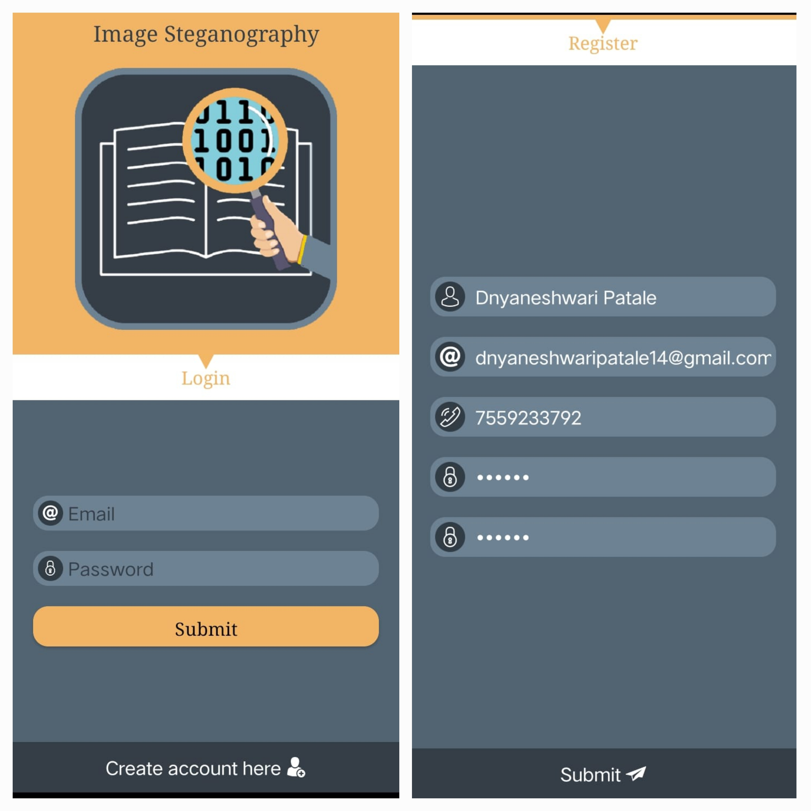
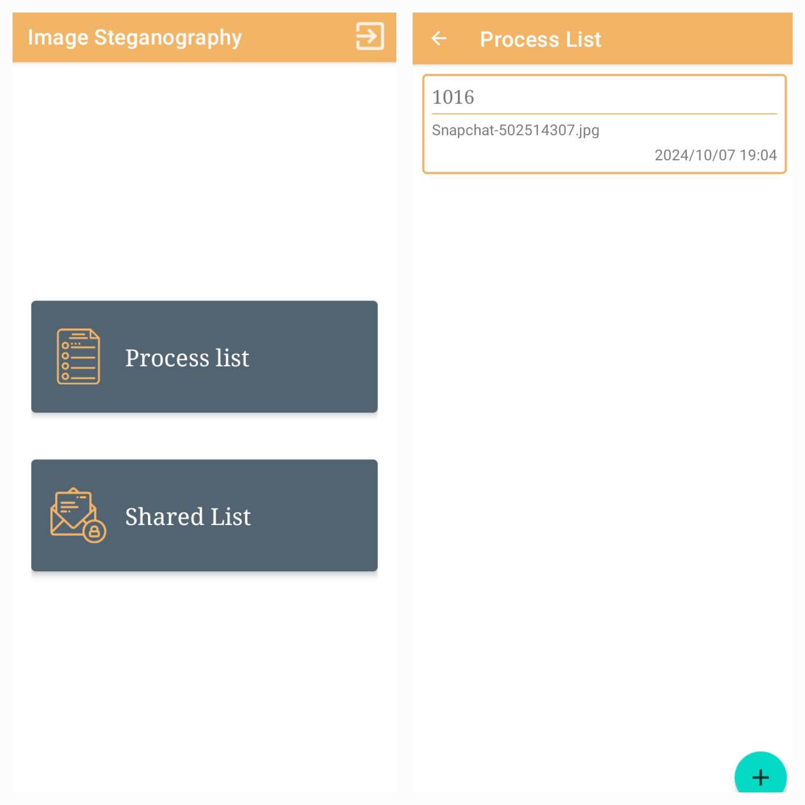

# **Image Steganography with Language Translation**

## **Project Overview**
This Android application implements **Image Steganography** to hide secret messages in images and utilizes the **Google Translation API** for translating those messages into different languages.

---

## **Key Features**
- Hide and retrieve secret messages within images securely.
- Translate messages into various languages using the Google Translation API.
- Simple and intuitive user interface for seamless interaction.

---

## **Technologies Used**
- **Android Studio**: IDE used for designing and developing the application.
- **Google Translation API**: Enables translation of text into multiple languages.
- **Azure Data Studio**: Used for managing and analyzing data (if applicable).

---

## **Requirements**
- Android device running version 5.0 (Lollipop) or later.
- Internet connectivity to access the translation feature.

---

## **Installation**
1. Download the APK file from the provided link.
2. Transfer the APK to your Android device if downloaded on another platform.
3. On your Android device:
   - Go to **Settings > Security > Install Unknown Apps**.
   - Enable installation for your browser or file manager.
4. Open the APK file and follow the installation steps.

---

## **How to Use**
### **1. Embedding Messages:**
   - Select an image from your device.
   - Input the message you want to hide.
   - (Optional) Translate the message into your desired language.
   - Save or share the encoded image.

### **2. Decoding Messages:**
   - Upload an encoded image.
   - Extract the hidden message.
   - (Optional) Translate the message if required.

---

## **Screenshots**
### **1. Home Screen**

### **2. Encode Message**

### **3. Decode Message**

---

## **Future Innovations**
1. **Error Detection and Correction**  
   - Implement algorithms to detect and correct errors in hidden messages.

2. **Advanced Encryption**  
   - Add encryption for extra security before embedding messages.

3. **Support for Multiple Image Formats**  
   - Extend support for formats like `.gif` and `.tiff`.

4. **Offline Translation**  
   - Implement offline translation using pre-trained models.

5. **Integration with Cloud Storage**  
   - Allow users to store encoded images securely in the cloud.

6. **User Authentication**  
   - Add user login to ensure only authorized users can access certain features.

---

## **Limitations**
- The translation feature requires an active internet connection.
- The application doesn't currently support error detection or correction in hidden messages.

---

## **Acknowledgments**
- **Google Translation API**: For powering the translation functionality.
- **Azure Data Studio**: For data management support.

---

## **Need the Source Code?**
If you need access to the source code or have any questions, feel free to contact me:  
- **Phone**: +91 7559233792  
- **Email**: dnyaneshwaripatale14@gmail.com
